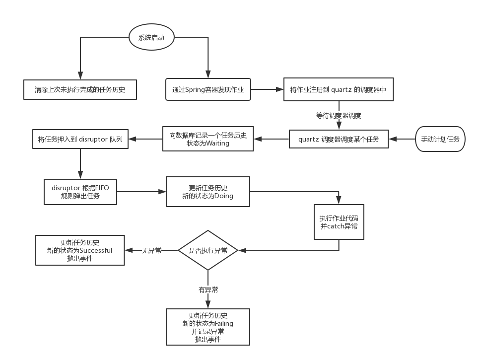

[TOC]

# 开发定期作业

## 1. 文档版本

版本号 | 编写人 | 摘要
---|---|---
1.0 | Felix | 第一稿 |
1.1 | Felix | 立即执行作业 [@ 6](#p6) |

## 2. 什么是作业

一个系统中，大部分的任务的触发时机，都是用户与 UI 的交互产生的。
比如，保存数据、更新数据、下载文件等等，用户通过对 UI 上的元素进行操作，继而产生任务。

但是，还有小部分的任务触发时间不依赖用户的操作。最典型的情景就是 *定期执行的任务*，还有一些情景可能是由 用户 创建了一个在未来某个时刻才会执行的任务。
那么这些通过时间、时刻触发的任务，我们称之为 **作业**。

## 3. 依赖项

* com.dexi.scheduler

需要在启动类上加上 **@EnabledQuartzScheduling** 的标记。

## 4. 创建作业

### 4.1 建议规则

* 所有的作业都以其用途命名，并以 Job 结尾
* 所有的作业都放在 jobs 的 package 中
* 名为 jobs 的 package 应当与 services、controller 同级

建议的文档目录
```
- com.dexi.srm
    + controller
    + services
    - jobs
        ClearUnusedDataJob.java
        SyncSomeDataJob.java
```

### 4.2 实现方法

直接上代码了

```java

package come.dexi.demos.how.to.create.a.job;

import com.dexi.scheduler.Job;
import com.dexi.scheduler.exceptions.JobException;
import org.springframework.context.ApplicationContext;

public class SyncSomeDataJob implements Job {
    @Override
    public void execute(ApplicationContext applicationContext) throws JobException {
        // some code here
        // 任务过程代码就在应当在此处进行编写
    }

    @Override
    public String getName() {
        // 这里是任务的名字，建议使用类名去掉 Job 的部分
        return "SyncSomeDataJob";
    }

    @Override
    public String getGroup() {
        // 这里是任务组的名字，建议目前直接使用 SRM
        // 系统再确定两个任务是否重复的方法是 名称和组 同时相同
        return "SRM";
    }

    @Override
    public String getCron() {
        // CRON 表达式，该表达式描述了任务将在什么时刻进行触发
        // 现在你看到的表示式定义了，每20分钟执行一次
        // 关于 CRON 表达式的写法，文章最后的部分给出了相关学习链接
        return "* */20 * * * ?";
    }

    @Override
    public String getDescription() {
        // 任务的友好描述，可以用于界面，日志等。
        // 这个描述相比于 name 更有利与开发者以外的人进行阅读
        return "同步某些数据";
    }
}

```

如果你希望系统能够自动计划这个任务，你需要做以下事情：

1. 在类上加上 **@Component**
2. 如果你的作业在 module 中，则还需要将你的作业所在的包名放置在 **Config** 类的 **@ComponentScan** 中

> 除了系统自动计划任务以外，还有手动计划任务的方法，可在下面一节进行了解。

### 4.3 手动计划作业

手动计划作业是比较少见的模式。

**com.dexi.scheduler.services** 中有一个接口 **JobService**，通过使用它的 **registJob(Job job)** 方法，可以实现手动计划作业。

### 4.4 监听作业的结束

作业的 成功/失败，均是通过 Spring 的事件总线发布的。

通过监听 **JobSuccessApplicationEvent** 或 **JobFailApplicationEvent** 事件便可以得到成功或失败的消息。
事件参数中的 getHistoryId 可以得到此次作业的历史记录行，getJob() 可以得到作业的实例

## 5. 工作原理

本作业使用到了两个第三方库

* quartz
* disruptor

这两个库中，quartz 主要负责通过 CRON 表达式激活一个任务；而 disruptor 是一个队列，它可以用来守卫 jvm，防止一时间被 quartz 创建的任务过多而导制线程过多性能下降。

### 5.1 工作流程图



### 5.2 为 disruptor 的消费者指定线程量

修改 Constant.WORK_HANDLER_COUNT 的值即可

## <b id="p6"></b> 6 创建立即执行任务

立即执行任务，并不是真正的立刻就会执行。

当你注册了一个立即执行任务以后，会发生下事情：
1. 向作业历史表中创建一条等待执行的记录，并得到一个历史记录ID
2. 向作业队列中追加该作业
3. 事件总线：**JobReadyApplicationEvent**，表示该作业已经准备被执行

此时，function 已经执行完毕，剩下的就是等待 disruptor 的凋度了。

注册立即执行任务的代码如下：
```java
JobService.registImmediateJob(job);
```

### 6.1 使用场景

立即执行任务的使用场景比较少。

一般来说，符合以下条件的，可以考虑使用该模式。

* 这是一个比较耗时的操作
* 操作的实时性低
* 用户不需要立即关心操作结果

### 6.2 使用负担

使用立即执行任务会带来更多的代码开销，这些开销主要是用来通知用户执行结果的。

1. 使用消息总线监听 Job 的 Ready ，并得到 HistoryId
2. 将 HistoryId 与 用户的信息 进行关联，并给予一个状态，如：NotFinished
3. 使用消息总线监听 Job 的 结束，并通过 HistoryId 更新上一步的状态，如 Success, Fail
4. 主动地/被动地 通知用户这些作业的执行结果


# 相关链接

* [CRON表达式详解](https://www.cnblogs.com/javahr/p/8318728.html)
* [并发框架Disruptor译文](http://ifeve.com/disruptor/)


---
[返回](../Index.md)